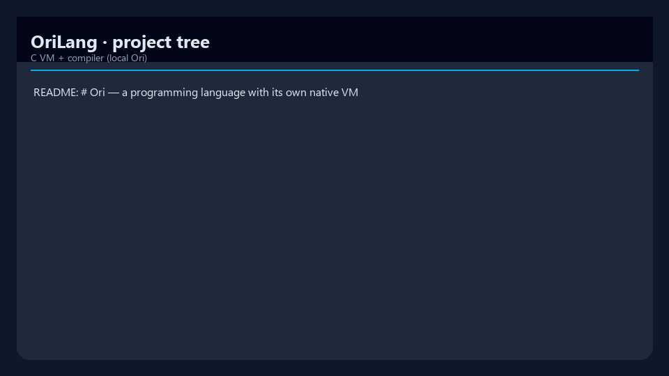
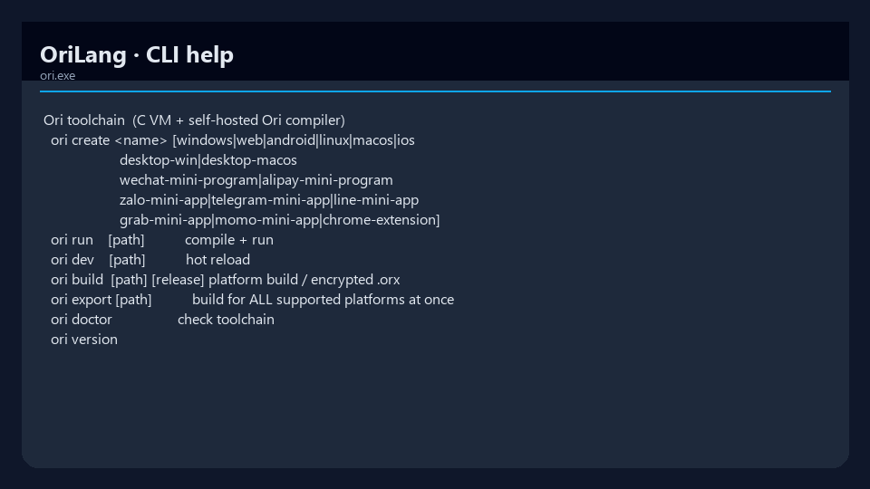

# OriLang

[](LICENSE)
[](core/orivm.c)
[](tools/oric.ori)
[](https://github.com/mergeos-bounties)

**Ori** es un lenguaje de programación pequeño y sin paréntesis obligatorios, con una **máquina virtual escrita en C**, un **compilador escrito en Ori** (autosuficiente) y una **CLI escrita en Ori** que se ejecuta sobre la VM. No depende de .NET, JVM ni otras plataformas externas — solo C y Ori.

| Repositorio | Rama por defecto |
| --- | --- |
| [ThanhTrucSolutions/OriLang](https://github.com/ThanhTrucSolutions/OriLang) | `main` |

---

## 📋 Contenidos

- [Características destacadas](#características-destacadas)
- [Capturas de pantalla](#capturas-de-pantalla)
- [Flujo de trabajo](#flujo-de-trabajo)
- [Visión general del lenguaje](#visión-general-del-lenguaje)
- [Guía de inicio rápido](#guía-de-inicio-rápido)
- [Plataformas y ejemplos](#plataformas-y-ejemplos)
- [Autosuficiencia y seguridad](#autosuficiencia-y-seguridad)
- [Estructura del proyecto](#estructura-del-proyecto)
- [Resumen del lenguaje](#resumen-del-lenguaje)
- [Diagramas](#diagramas)
- [Limitaciones](#limitaciones)
- [Bounties de MergeOS](#bounties-de-mergeos)
- [Licencia](#licencia)

---

## ✨ Características destacadas

| Capa | Implementación |
| --- | --- |
| **VM núcleo** | [core/orivm.c](core/orivm.c) — bytecode en pila, arrays, recursión, funciones nativas (`http_get`, …), SHA-256/HMAC, ChaCha20 |
| **Compilador** | [tools/oric.ori](tools/oric.ori) — autosuficiente; se distribuye como `tools/oric.orb` (punto fijo byte-exacto) |
| **CLI** | [tools/ori.ori](tools/ori.ori) → `ori.orb`; arranque en C con [tools/ori.c](tools/ori.c) |
| **Plataformas** | Windows, Linux, macOS, **WASM**, Android APK, iOS Simulator, mini-apps, extensión de Chrome |
| **Compilación segura** | `ori build <p> release` → archivo `.orx` encriptado + permutación de opcodes por compilación |

Un proyecto es una carpeta `ori/` más un archivo `<nombre>.meta`.

---

## 🖼️ Capturas de pantalla

| Árbol de proyecto | CLI |
| :---: | :---: |
|  |  |
| *Captura de la estructura del repositorio* | *Captura de la ayuda de la CLI* |

---

## 🔄 Flujo de trabajo

```text
   .ori  ──►  oric (compilador, escrito en Ori)  ──►  .orb  ──►  orivm (VM en C)  ──►  ejecución
   fuente        se ejecuta sobre la VM C             bytecode
                                            ori build <p> release ──►  .orx (encriptado)

<<<<<<< HEAD
   ori CLI is also written in Ori:
   tools/ori.ori  ──►  tools/ori.orb  (compiled by oric)
   tools/ori.c    ──►  ori.exe         (thin C bootstrap — just runs orivm tools/ori.orb)
```

---

## Language overview

Function calls and definitions use **juxtaposition** — no parentheses required:

```ori
say "Hello from Ori!"          // say(...)

fold fib n {                   // define: params are just names
    when n < 2 { give n }
    give fib (n - 1) + fib (n - 2)
}

say (fib 10)                   // 55 — parens only group a compound argument
```

- **Application binds tightest:** `fib n - 1` means `(fib n) - 1`. To pass a compound expression, group it: `fib (n - 1)`.
- Keywords: `hold` (variable), `fold` (function), `give` (return), `when` / `else when` / `else`, `loop` (while), `yes`/`no` (bool), `none` (nil).
- Types: number, string, bool, none, function, array. Operators: `+ - * / %`, `== != < > <= >=`, `&& || !`. `+` on strings concatenates.
- Built-ins: `say`, `str`, `num`, `len`, `push`, `pop`, `char_at`, `ord`, `chr`, `substr`, `type`, `abs`, `floor`, `sqrt`, `http_get` (calls `curl`), `env`, `exists`, `run`, `glob`, `mtime`, `sleep_ms`, `read_bytes_b64`, and more.
- Comments: `//`, `#`, `/* ... */`.
- Legacy `f(a, b)` call syntax is also accepted by the compiler.

```ori
fold fib n {
    when n < 2 { give n }
    give fib (n - 1) + fib (n - 2)
}

hold xs = [10, 20, 30]
xs[1] = 99
push (xs, 40)

hold i = 0
loop i < len xs {
    say ("xs[" + str i + "] = " + str xs[i])
    i = i + 1
}
```

---

## Quick start

One-time bootstrap (needs Visual Studio C++ tools / MSVC on Windows):

```bat
build.cmd            ::  builds core\orivm.exe, compiles tools\ori.ori -> tools\ori.orb, builds ori.exe
```

On Linux/macOS:

```sh
sh build.sh          # builds core/orivm, compiles tools/ori.ori -> tools/ori.orb, builds ./ori
```

Then:

```bat
ori create myapp           ::  scaffolds  myapp\ori\main.ori  +  myapp\myapp.meta
ori run    myapp           ::  compile + run on the native C VM
ori dev    myapp           ::  hot reload: edit ori\main.ori and it re-runs
ori build  myapp release   ::  -> myapp\build\app.orx  (encrypted)
ori doctor                 ::  check the toolchain
```

Project structure:

```text
myapp/
  ori/main.ori        your code
  myapp.meta          name / version / entry / platform / dependencies
```

Manifest (`*.meta`):

```text
name: myapp
version: 1.0.0
entry: ori/main.ori
platform: windows     # windows | web | android | linux | macos | ios |
                      # wechat-mini-program | alipay-mini-program |
                      # zalo-mini-app | telegram-mini-app | line-mini-app |
                      # grab-mini-app | momo-mini-app | chrome-extension
ui: console           # or: window  (for GUI apps on windows/macos)
dependencies:
```

### By hand

```bat
build.cmd
core\orivm.exe tools\oric.orb  ori\main.ori  build\app.orb
core\orivm.exe build\app.orb
core\orivm.exe tools\oric.orb  tools\oric.ori  tools\oric.orb
core\orivm.exe tools\oric.orb  tools\ori.ori   tools\ori.orb
core\orivm.exe pack app.orb app.orx
```

```sh
sh build.sh
./ori run samples/console
./ori run samples/web
./ori build samples/mobile-android
```

---

## Platforms & sample apps

| Platform | `platform:` | Sample | How to run |
| --- | --- | --- | --- |
| Windows (console) | `windows` | [samples/console](samples/console) | `ori run samples/console` |
| Windows (GUI) | `windows` + `ui: window` | [samples/desktop-win](samples/desktop-win) | `ori run samples/desktop-win` |
| Linux (console) | `linux` | [samples/linux](samples/linux) | `ori build samples/linux` |
| macOS (console) | `macos` | [samples/macos](samples/macos) | `ori build samples/macos` (on macOS) |
| macOS (GUI) | `macos` + `ui: window` | [samples/desktop-macos](samples/desktop-macos) | `ori build samples/desktop-macos` (on macOS) |
| Web (WASM) | `web` | [samples/web](samples/web) | `ori run samples/web` |
| Web (Todo) | `web` | [samples/todo-web](samples/todo-web) | `ori run samples/todo-web` |
| Android | `android` | [samples/mobile-android](samples/mobile-android) | `ori build samples/mobile-android` |
| iOS | `ios` | [samples/mobile-ios](samples/mobile-ios) | `ori build samples/mobile-ios` (on macOS) |
| WeChat Mini | `wechat-mini-program` | [samples/wechat-mini-program](samples/wechat-mini-program) | `ori build` → WeChat DevTools |
| Alipay Mini | `alipay-mini-program` | [samples/alipay-mini-program](samples/alipay-mini-program) | `ori build` → Alipay Studio |
| Zalo Mini | `zalo-mini-app` | [samples/zalo-mini-app](samples/zalo-mini-app) | `ori build` → zmp-cli |
| Telegram Mini | `telegram-mini-app` | [samples/telegram-mini-app](samples/telegram-mini-app) | `ori build` → BotFather WebApp |
| LINE Mini | `line-mini-app` | [samples/line-mini-app](samples/line-mini-app) | `ori build` → LINE LIFF |
| Grab Mini | `grab-mini-app` | [samples/grab-mini-app](samples/grab-mini-app) | `ori build` → GrabMini console |
| MoMo Mini | `momo-mini-app` | [samples/momo-mini-app](samples/momo-mini-app) | `ori build` → MoMo Mini App Center |
| Chrome Extension | `chrome-extension` | [samples/chrome-extension](samples/chrome-extension) | `ori build` → `chrome://extensions` |

### Sample apps use free, no-key APIs

- **console**: random programming joke from [JokeAPI](https://v2.jokeapi.dev/)
- **web**: live crypto prices from [CoinGecko](https://api.coingecko.com/) (free tier, no key)
- **linux**: live Hanoi weather from [Open-Meteo](https://open-meteo.com/) (free, no key)
- All GUI samples: generic todo-list model — **the project code is always Ori**.

### Generic host architecture

Every GUI host is thin — it knows only these widget lines:

```text
text|CONTENT                         label
edit|PLACEHOLDER                     text input (value passed as @edit)
btn|EVENT|ARG|CAPTION                button
item|TOGGLE_EVENT|DEL_EVENT|ARG|CAP  list item with toggle + delete
```

The host calls `render()` to get the spec and `dispatch(ev, arg)` on events. App logic is 100% in Ori. The same `ori/main.ori` runs on Windows, Android, iOS, every mini-app platform, and Chrome — only the thin view layer differs.

---

## Self-hosting & hardening

- **Self-hosting.** The compiler (`tools/oric.ori`) and the CLI (`tools/ori.ori`) are both written in Ori. The compiler compiles itself to a byte-identical fixpoint.
- **Per-build opcode randomization.** `ori build release` picks a fresh random opcode permutation; two builds of the same source differ entirely.
- **Encryption.** `.orx` = ChaCha20 + HMAC-SHA256; the VM refuses tampered images.

---

## Project layout

| Path | Role |
| --- | --- |
| `core/orivm.c` | The C VM (stack-based bytecode executor, SHA-256, ChaCha20) |
| `tools/oric.ori` | Ori compiler written in Ori |
| `tools/oric.orb` | Shipped self-hosted compiler image |
| `tools/ori.ori` | **Ori CLI written in Ori** — all build/run/create logic |
| `tools/ori.c` | Thin C bootstrap: finds VM + `ori.orb`, hands off |
| `tools/web/` | Prebuilt WebAssembly runtime (`orivm.js` + `orivm.wasm`) |
| `build.cmd` / `build.sh` | Bootstrap (Windows / POSIX) |
| `platforms/*` | Win32, web, Android, macOS, iOS, mini-app hosts |
| `samples/` | Platform sample projects (`ori/main.ori` + `*.meta`) |
| `docs/TOOLCHAIN.md` | Architecture & build guide |
| `docs/diagrams/` | Architecture + workflow SVGs |

---

## Language summary

See [docs/CHEATSHEET.md](docs/CHEATSHEET.md) for a comprehensive language cheatsheet!

| Feature | Syntax |
| --- | --- |
| Variable | `hold x = 42` |
| Function | `fold add a b { give a + b }` |
| Call (juxtaposition) | `add 1 2` |
| Call (legacy parens) | `add(1, 2)` |
| Conditional | `when x > 0 { ... } else { ... }` |
| Loop | `loop x < 10 { x = x + 1 }` |
| Array | `[1, 2, 3]` — `arr[i]` — `push(arr, v)` |
| HTTP | `http_get "https://api.example.com/data"` |
| Return | `give value` |

---

## Diagrams

System architecture and workflow — full width. Open the HTML files for **dark/light theme** and export (PNG/SVG). 
See [docs/ARCHITECTURE.md](docs/ARCHITECTURE.md) for Mermaid flow diagrams.

### Architecture

[Open interactive diagram](docs/diagrams/architecture.html)

<p align="center">
  
</p>

### Workflow

[Open interactive diagram](docs/diagrams/workflow.html)

<p align="center">
  
</p>

*Generated with [archify](https://github.com/tt-a1i).*

---

## Limitations

- No closures / nested functions.
- Numbers are IEEE-754 doubles; booleans are **not** numbers (don't use `yes`/`no` in arithmetic).
- Android builds from the Windows SDK/NDK pipeline; iOS requires macOS + Xcode.
- `http_get` shells out to `curl` — curl must be in PATH.

---

## MergeOS bounties

Star this repo + [mergeos](https://github.com/mergeos-bounties/mergeos), claim open `bounty` issues, PR to **`main`**. Policy: [docs/BOUNTY.md](docs/BOUNTY.md). MRG **25–200** after merge.

---

## Tiếng Việt — Bắt đầu nhanh

**Ori** là ngôn ngữ lập trình không bắt buộc ngoặc, có VM viết bằng C và compiler self-hosting. Không cần .NET, không JVM — chỉ C và Ori.

### Cài đặt

```bash
git clone https://github.com/ThanhTrucSolutions/OriLang.git
cd OriLang
# Windows
build.cmd
# Linux / macOS
bash build.sh
```

### Dự án đầu tiên

```bash
mkdir myapp && cd myapp
cat > hello.ori << 'EOF'
fn main
  print "Xin chào thế giới!"
end
EOF
cd ..
ori run myapp
```

### Cú pháp cơ bản

| Khái niệm | Cú pháp Ori | Giải thích |
| --- | --- | --- |
| Hàm | `fn tên_hàm ... end` | Khai báo hàm mới |
| Biến | `let x = 5` | Gán giá trị |
| In ra | `print "xin chào"` | In ra console |
| Điều kiện | `if x > 0 ... end` | Kiểm tra điều kiện |
| Vòng lặp | `loop n ... end` | Lặp n lần |
| Mảng | `let a = [1, 2, 3]` | Mảng nguyên thủy |

### Ví dụ: máy tính bỏ túi

```bash
ori create calc
# Trong calc/main.ori:
fn main
  let a = 7
  let b = 3
  print a + b
  print a * b
  print a - b
end
```

### Tài nguyên

- [Điểm nổi bật](#highlights)
- [Mẫu demo](#platforms--sample-apps)
- [Tóm tắt ngôn ngữ](#language-summary)
- [GitHub](https://github.com/ThanhTrucSolutions/OriLang)

---

## Contributing

See [CONTRIBUTING.md](CONTRIBUTING.md) for build prerequisites (Windows MSVC / Linux / macOS), first steps (`ori create` / `ori run`), and MergeOS bounty workflow.

---

## License

MIT · MergeOS / ThanhTrucSolutions
=======
   La CLI de Ori también está escrita en Ori:
   tools/ori.ori  ──►  tools/ori.orb  (compilado por oric)
   tools/ori.c    ──►  ori.exe        (arranque en C — ejecuta orivm tools/ori.orb)
>>>>>>> 7b874cb (docs: improve README with better structure and clarity #14)
