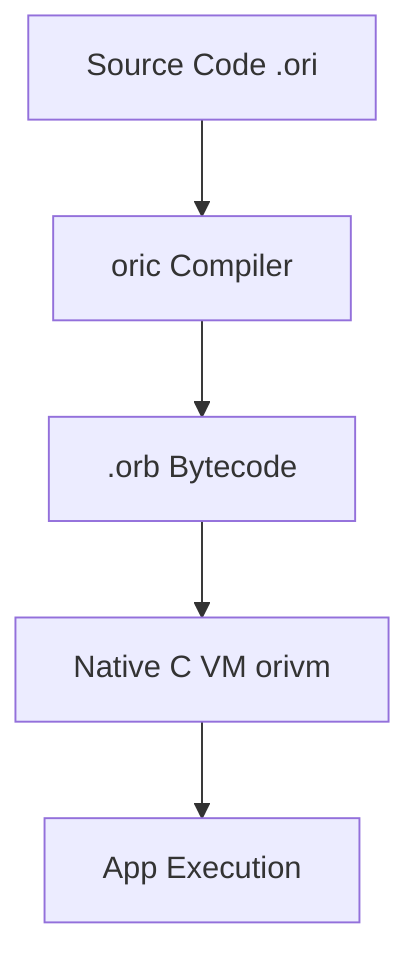
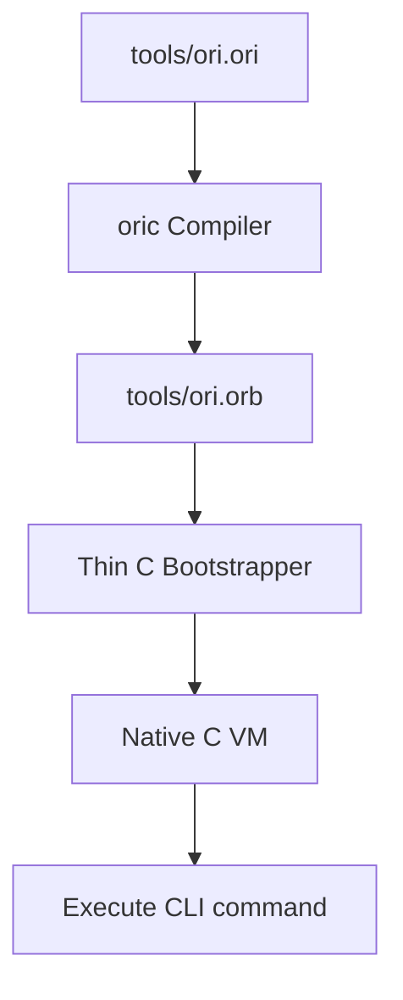

# OriLang Architecture

OriLang's architecture revolves around a simple, self-hosting stack. 

The pipeline is entirely native and free of heavy external dependencies like JVM or .NET.

## Overview

## CLI Architecture
The `ori` CLI is itself written in Ori.

## Compilation and Execution
During compilation, source files are translated directly into Ori's bytecode format.

For deployment, `.orb` bytecode files are optionally encrypted into `.orx` executables to protect source integrity. The Native C VM `orivm` reads the bytecode and executes it.
